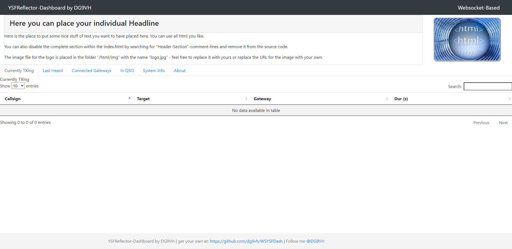

# WSYSFDash

## Introduction
This is a very first development version of my new WSYSFDash using websockets-Technology.

## Technical Details
The Dashboard persists in detail in 3 components: two on the server (Reflector) side and on on the browser.

The two server sided components are the logtailer.py (which communicates via websocket with your browser and streams the logs to it for processing) and the webserver-component from python3 (which is serving the needed html and javascript infrastructure to your browser).

The client based component is the javascript processing the streamed log lines and filling the tables.

## Used Ports

By default following Ports are used for running the Dashboard:
* 8000 TCP: webservice
* 5678 TCP: Websocket

## Installation
You'll need to install several python3 modules. A concrete list will follow here later.
Actually known:

* websockets: `sudo apt install python3-websockets`
* ansi2html: `sudo pip3 install ansi2html`
* psutil: `sudo apt install python3-psutil`

### Recommendations
* take care to set Loglevel for FileLevel = 1 in your YSFReflector.ini
* also set debug = 0 on each section to avoid irritating output on the Dashboard
* Python3.7 at least must be installed

### Installation steps
* clone this repository to your home-directory with `git clone --recurse-submodules -j8 https://github.com/dg9vh/WSYSFDash` to clone the repository with it's submodules
* create directory with `sudo mkdir /opt/WSYSFDash`
* change ownership to your user for example with `sudo chown -R <your username> /opt/WSYSFDash` for easier handling with the files
* copy all files from repository into this folder
* modify *logtailer.ini* to fit your needs
* modify */html/js/config.js* to fit your needs, here you can switch on/off tabs showing or enable debug for getting some output in javascript console. You should take a look into this file - here are different options you can configure.
* copy files in */opt/WSYSFDash/systemd* to */lib/systemd/system* or similar corresponding to your system
* modify both scripts to fit your needs
* enable services with following commmands, this results in starting both automatically after reboot:
  * `sudo systemctl enable http.server.service`
  * `sudo systemctl enable logtailer.service`
* start services with following commmands:
  * `sudo systemctl start http.server.service`
  * `sudo systemctl start logtailer.service`

Finally you should be able to get the new Dashboard calling the hostname of your hotspot and port 8000 (default) in your broser

### Troubleshoting
If you have any trouble running the software most things depend on the logtailer-component. So it is a good idea to try starting the software on the console wih
`python3 ./logtailer.py` to see the output of the programme. A common error are missing python-libraries you should install with the commands mentioned above.

If you found any further missing library let me know! Just open an issue!

If there are problems with paths for logfiles you also could get some impressions with the output of the programme.

## Best Practise Installation
For getting the best user experience it is recommended to configure your YSFReflector with the following parameter:

`FileRotate=0`

This results in having only one logfile for each programme and having it rotated by your linux-system with logrotate if configured.

You should also configure your logtailer.ini with

`FileRotate=False`

to have the logtailer in correct behaviour for reading this file.

To configure log rotation in Linux take a look at https://www.tecmint.com/install-logrotate-to-manage-log-rotation-in-linux/.

It is also recommended using an explicit webserver for better security behavior, see next chapter.

## Integration in existing webserver-installation
If you have already a webserver (apache2 or similar) running on your system, you also can serve the contents within the html-folder by this. Here you only have to copy the folder/the files into the decided web-space and they are available with your regular webserver.

If you are running TLS (https://) you have to enable logtailer.py to use TLS (wss://) also. Here you have to do two thing:
* in logtailer.ini enable the SSL-Part and configure the correct paths to your cert-chain and key and
* in the index.html look for the "ws://"-parts and supersede them by "wss://"

This enables TLS for encrypted and secured transport of your data and prohibits modern browsers from denying to operate on the website. Modern browsers don't like "mixed-mode-content" and therefore they are blocking the contents and do not run the page correctly.

## Running on Systems with multiple YSFReflectors
If you are planning to run this dashboard on a system with multiple YSFReflectors, it is recommended to serve the static html-files through a regular webserver like Apache2 or similar.
Within logtailer.ini you have the possibility to add new logging-sections for each YSFReflector to serve it's own logfile.

Within the html-part (/js/config.js) please set the `WebsocketsPath`-variable to the corresponding config-section in logtailer.ini that contains the correct log-path for your YSFReflector.

## Some Words on Functionalities
This dashboard works best with the actual version of pYSFReflector (https://github.com/iu5jae/pYSFReflector) but it stays compatible to the origin YSFReflector by G4KLX.

On G4KLX-YSFReflector some functionalities does not deliver information every time (for example: in Gateway-Tabs the is a column "connected since", here not every line has plausible information).
With pYSFReflector this infos are filled, so it would be recommended to switch over to the python reflector.

## Credits

*logtailer.py* is based on the work of http://shzhangji.com/blog/2017/07/15/log-tailer-with-websocket-and-python/

## Screenshots

